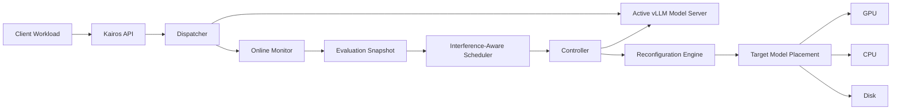
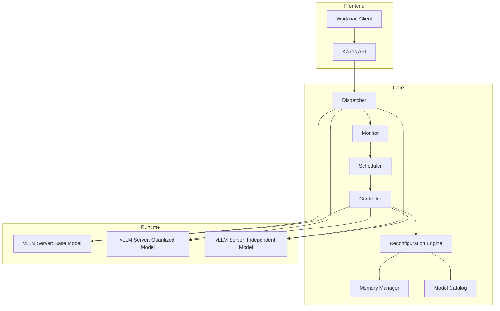
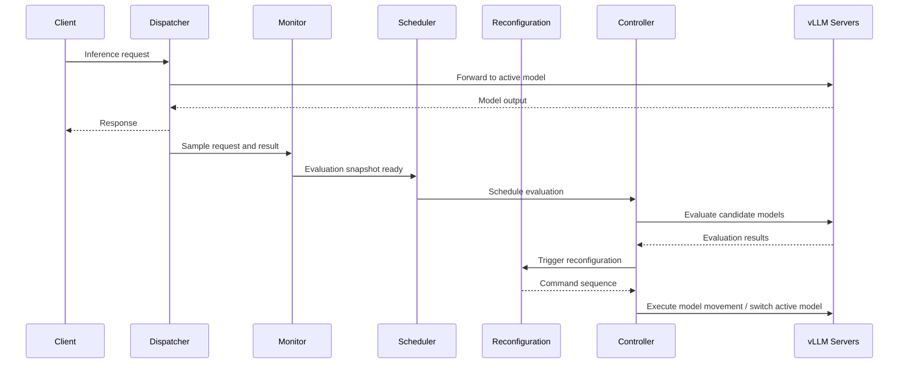

# Kairos

**Workload-aware reconfigurable LLM serving.**

Kairos is an adaptive LLM serving system that continuously monitors live inference traffic, evaluates alternative models on real requests, and reconfigures model placement across GPU, CPU, and disk at runtime.

The goal is simple:

> Serve requests with the best currently available model configuration while satisfying latency and accuracy objectives under changing workloads.

Kairos combines online monitoring, model evaluation, memory-aware placement, and interference-aware scheduling to dynamically decide which model should serve traffic and which models should remain warm, sleeping, prefetched, or evicted.

---

## Why Kairos?

Modern LLM serving systems often assume that the deployed model is fixed. In practice, this is rarely ideal.

A high-quality base model may be too slow under load.  
A quantized model may be faster with only a small accuracy loss.  
A smaller independent model may be sufficient for simpler workloads.  
The best choice can change over time.

Kairos treats model selection and model placement as runtime decisions.

Instead of statically serving one model, Kairos continuously asks:

- Which model currently satisfies the accuracy and latency objectives?
- Which model should actively serve requests?
- Which alternative models should be kept on GPU, CPU, or disk?
- When can background evaluations be scheduled without disturbing active serving?
- How can reconfiguration be performed with minimal service disruption?

---

## Core Idea

Kairos maintains a pool of candidate models and adapts their runtime state based on observed workload behavior.



Kairos observes real requests, samples them, evaluates candidate models, computes service-level indicators, and reconfigures the serving setup when another model or placement becomes preferable.

---

## Features

### Online Monitoring

Kairos samples incoming requests during normal serving and builds evaluation snapshots from real workload data.

This allows candidate models to be compared on the same requests the system actually receives.

---

### Runtime Model Reconfiguration

Kairos can switch the active serving model at runtime and adjust model placement without restarting the whole system.

Supported model states include:

- Active on GPU
- Sleeping on GPU with reduced memory footprint
- Prefetched into CPU memory
- Evicted to disk

---

### vLLM Integration

Kairos builds on vLLM and uses its runtime mechanisms for efficient model movement.

Supported mechanisms include:

- GPU wake-up
- Persistent wake-up
- L1 sleep
- L2 sleep
- CPU prefetching
- Disk eviction

---

### Memory-Aware Placement

Kairos models GPU and CPU memory explicitly.

It distinguishes between:

- Full GPU memory required by an awake model
- Reduced GPU memory occupied by a sleeping model
- Additional wake-up memory required to reactivate a sleeping model
- CPU memory required for prefetched models

This allows Kairos to decide which models should be kept close to the GPU and which models should be moved further away.

---

### Interference-Aware Scheduling

Background model evaluation can interfere with active serving.

Kairos therefore schedules evaluations during predicted low-load windows and controls how many evaluation requests are sent concurrently.

This keeps monitoring useful without overwhelming the active inference service.

---

### Objective-Based Model Selection

Kairos evaluates models according to configurable service objectives such as:

- Relative accuracy compared to a base model
- Median or percentile latency
- Accuracy SLO
- Latency SLO
- Weighted objective scores

Models that satisfy all objectives are preferred, while infeasible models are still ranked by how close they are to satisfying the objectives.

---

## System Architecture

Kairos is structured around five main components.



### API

Receives inference requests and forwards them to the Kairos core.

### Dispatcher

Routes incoming requests to the currently active model server.

### Monitor

Samples requests and stores model outputs, labels, latency measurements, and metadata.

### Scheduler

Decides when background evaluations should run based on workload behavior.

### Reconfiguration Engine

Ranks models, computes target placements, and plans transitions between current and target states.

### Controller

Executes commands such as waking models, sleeping models, changing the active model, or evaluating candidate models.

### Memory Manager

Tracks available GPU, CPU, and disk capacity and validates whether placement transitions are feasible.

---

## Adaptive Control Loop

Kairos repeatedly executes the following loop:



The system adapts only when the monitored results indicate that another configuration is better under the current workload.

---

## Example Configuration

Kairos is configured using a YAML file that defines models, objectives, memory assumptions, and scheduling parameters.

```yaml
models:
  - model_id: llama-8b-bf16
    name: meta-llama/Llama-3.1-8B-Instruct
    relation: base
    port: 8100
    gpu_factor: 1.30

  - model_id: llama-8b-fp8
    name: meta-llama/Llama-3.1-8B-Instruct-FP8
    relation: quantized
    base_model: llama-8b-bf16
    port: 8101
    gpu_factor: 0.80

  - model_id: qwen-4b
    name: Qwen/Qwen3-4B-Instruct
    relation: independent
    port: 8102
    gpu_factor: 1.30

objectives:
  accuracy_slo: 0.95
  latency_slo_ms: 200

  weights:
    accuracy: 0.7
    latency: 0.3

monitoring:
  sample_rate: 10
  sample_size: 100

scheduling:
  forecast_horizon_seconds: 20
  max_in_flight_evaluation_requests: 4
```

---

## Installation

### Requirements

Kairos is designed for Linux-based GPU servers.

Recommended environment:

- Python 3.10+
- Docker
- NVIDIA GPU
- NVIDIA Container Toolkit
- CUDA-compatible NVIDIA driver
- vLLM-compatible model checkpoints
- Hugging Face access token for gated models

Clone the repository:

```bash
git clone https://github.com/<your-org>/kairos.git
cd kairos
```

Create a virtual environment:

```bash
python -m venv .venv
source .venv/bin/activate
```

Install Kairos:

```bash
pip install -e .
```

Install development dependencies if needed:

```bash
pip install -e ".[dev]"
```

---

## Running Kairos

Start the Kairos core:

```bash
python -m kairos.core --config configs/config.yaml
```

Start the API server:

```bash
uvicorn kairos.api.main:app --host 0.0.0.0 --port 8000
```

Send an inference request:

```bash
curl -X POST http://localhost:8000/infer \
  -H "Content-Type: application/json" \
  -d '{
    "instruction": "Answer the following question.",
    "prompt": "Is the sky blue during a clear day?",
    "answer": "yes",
    "dataset": "boolq",
    "arrival_timestamp": 1710000000.0
  }'
```

Example response:

```json
{
  "kairos": {
    "active_model": "llama-8b-bf16",
    "correct": true,
    "infer_latency_ms": 112.4
  },
  "result": "yes"
}
```

---

## Experiments

Kairos includes experiments for analyzing model movement, model selection, and end-to-end reconfiguration behavior.

### Model Movement

Measures the latency and memory behavior of vLLM runtime mechanisms such as sleep, wake-up, prefetching, and eviction.

Example questions:

- How expensive is waking a model from CPU memory?
- How much GPU memory remains occupied while a model is sleeping?
- How much faster is persistent wake-up compared to a full reload?
- What is the cost of evicting a model from CPU memory to disk?

---

### Model Selection Trade-offs

Compares base, quantized, and independent models under different workloads.

Typical metrics:

- Relative accuracy compared to the base model
- Median latency
- p95 latency
- Request throughput
- SLO satisfaction

Example model groups:

- Base BF16 model
- FP8 / INT8 / INT4 / NF4 quantized variants
- Smaller independent models from other model families

---

### End-to-End Reconfiguration

Evaluates whether Kairos can adapt to workload changes by selecting a better serving model and adjusting model placement accordingly.

Typical questions:

- Does Kairos switch models when the workload changes?
- Does it preserve latency objectives during reconfiguration?
- How long does reconfiguration take?
- Which commands dominate reconfiguration latency?
- How much request disruption is caused by model movement?

---

## Repository Structure

```text
kairos/
├── api/                     # FastAPI server and request handling
├── core/
│   ├── catalog/             # Model catalog and model metadata
│   ├── control/             # Controller and control commands
│   ├── memory/              # GPU/CPU/disk memory tracking
│   ├── monitoring/          # Sampling and online monitoring
│   ├── reconfiguration/     # Model ranking, placement, and planning
│   └── scheduling/          # Evaluation scheduling
├── experiments/             # Experiment scripts and plotting utilities
├── configs/                 # Example Kairos configurations
├── scripts/                 # Helper scripts
└── README.md
```

---

## Design Principles

Kairos is built around three design principles.

### Continuous Monitoring

The system observes live requests and evaluates models on representative workload samples instead of relying only on offline benchmarks.

### Runtime Reconfigurability

The serving setup can change at runtime. Kairos can switch the active model and move models between GPU, CPU, and disk depending on current objectives and memory constraints.

### Interference-Aware Scheduling

Background evaluation and model movement are scheduled carefully because they can interfere with active serving. Kairos explicitly models this interference and avoids treating evaluation as a free operation.

---

## Research Context

Kairos explores adaptive serving for large language models under changing workloads.

The system is motivated by the observation that no single model configuration is optimal for all situations. A large model may provide the best quality, while quantized or smaller models may satisfy the same workload with lower latency and higher throughput.

Kairos therefore combines ideas from:

- LLM serving systems
- Runtime model reconfiguration
- Model routing
- Quantized inference
- Memory-aware scheduling
- Workload-aware systems design

---

## Status

Kairos is research software developed as part of a master’s thesis on adaptive LLM serving systems.

The implementation focuses on a single-node GPU setting with multiple vLLM model servers and a separate Kairos control plane.

---

## Citation

If you use Kairos or build on it, please cite the thesis or repository once available.

```bibtex
@mastersthesis{enjilian2026kairos,
  title  = {Kairos: Workload-Aware Reconfigurable LLM Serving},
  author = {Rene Enjilian},
  school = {Heidelberg University},
  year   = {2026}
}
```

---

## License

Add your license here before public release.

Recommended options:

- MIT License for permissive open-source release
- Apache License 2.0 for permissive release with explicit patent terms
- Private academic repository if the thesis is not yet public

---

## Acknowledgements

Kairos builds on vLLM and the broader open-source LLM serving ecosystem.

The project was developed in the context of research on efficient and adaptive systems for large language model inference.