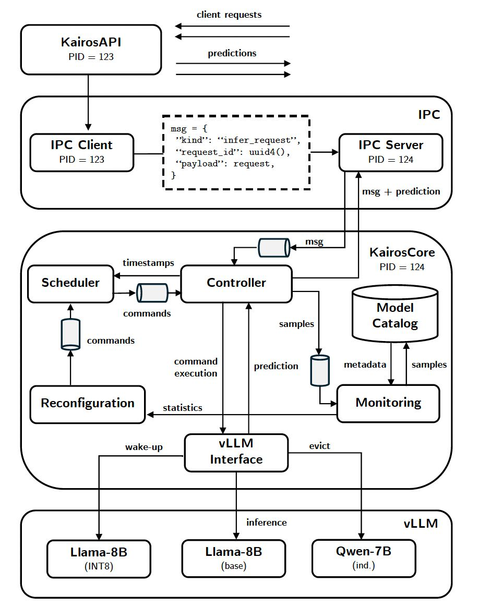

# Kairos

**Workload-aware and reconfigurable LLM serving, built on vLLM.**


Kairos is a serving system that adapts itself to the workload it observes. While
serving requests with a high-quality base model, it samples the live request
stream and evaluates cheaper candidates — quantized variants and smaller
independent models — on those sampled requests in the background. When a
candidate satisfies the configured accuracy and latency objectives (SLOs), Kairos
switches the active model at runtime and reorganizes where model weights reside
across GPU memory, CPU memory, and disk. Disruptive actions are deferred to
forecasted idle windows in the request stream, so adaptation interferes as little
as possible with live serving.

The result: the system discovers on its own, from live traffic, that a cheaper
model is good enough — and moves to it without stopping.

📄 The full design and evaluation are documented in the accompanying Master's
thesis: [**Workload-aware and Reconfigurable LLM Serving** (PDF)](docs/thesis.pdf).

---

## Motivation

LLMs are increasingly deployed as interactive inference services: requests arrive
continuously, users expect low response latency, and providers operate under
limited GPU memory and compute. At the same time, different model variants —
full-precision, quantized, or smaller independent models — expose different
trade-offs between output quality, latency, and memory footprint. Which variant
is preferable is not fixed: it depends on the current workload, the request rate,
and the service-level objectives, and the accuracy cost of a cheaper variant
varies with the task and quantization scheme.

Static deployments cannot exploit this. They select one model and one placement
at startup, even though the conditions under which the system operates change
during serving. Existing inference engines such as vLLM make a *given*
configuration efficient — through continuous batching and paged KV-cache
management — but they do not decide when the configuration itself should change.

Kairos addresses this gap. It treats the serving configuration as a runtime
decision: monitoring the observed workload, evaluating candidate models against
the configured objectives on real sampled requests, and reconfiguring model
selection and placement while serving continues.

## Design principles

| | Principle | Realized by |
|---|---|---|
| P1 | **Continuous monitoring** — measure candidate models on sampled live requests, with the base model's outputs as accuracy reference (no labels needed) | Monitoring component |
| P2 | **Runtime reconfigurability** — switch the active model and move weights across GPU / CPU / disk while serving | Reconfiguration + vLLM extensions |
| P3 | **Interference-aware scheduling** — delay disruptive commands until a forecasted idle window | Scheduler (Holt-Winters et al.) |

## Architecture


<p align="center">
  
</p>

Kairos is structured into four layers: the client-facing **KairosAPI**, an
**IPC layer**, the **KairosCore** orchestration process, and the **vLLM
runtime layer**. API and Core run as separate processes, so client-facing
request handling is isolated from internal orchestration.

**Request flow.** A client submits a request to the KairosAPI (`/infer`), which
validates it against the request schema and records the arrival timestamp — the
signal the scheduler later uses for idle-window forecasting. The request crosses
the IPC boundary (ZeroMQ, DEALER/ROUTER) into KairosCore, where the controller
places it into the internal request queue and dispatches it to the currently
active vLLM model server. Dispatch is concurrent: each request becomes its own
asynchronous task, so overlapping requests reach vLLM and its continuous
batching stays effective. The completed result — generated answer, correctness
value, inference latency, serving model — returns through the same path.
Responses may complete out of order; request identifiers match them back to the
pending API calls.

**KairosCore components.**

- **Controller** — the central coordination point. It admits validated requests
  into the request queue, runs the concurrent dispatcher (bounded by a
  semaphore, with a dispatch gate that can pause forwarding during selected
  control operations), executes control commands (starting/stopping model
  servers, model-state transitions, setting the active model), and evaluates
  candidate models on sampled requests — concurrently, with results grouped per
  model.

- **Monitoring** (P1) — samples request–result pairs from live traffic at a
  configurable rate into a bounded rolling window. Once full, the window is
  frozen into an evaluation snapshot, so every candidate model is evaluated on
  identical inputs. From the results, the monitor computes per-model SLIs —
  accuracy relative to the base model and p95 inference latency — and records
  SLO satisfaction. Discard, recycle, and monotonicity policies prune which
  candidates remain in future evaluation rounds.

- **Model catalog** — the shared registry of all registered models: Hugging Face
  identifier, server port, relation (base / quantized / independent), memory
  estimates, current placement in the memory hierarchy, and the latest
  evaluation statistics. All components read model state from here.

- **Reconfiguration** (P2) — translates monitoring statistics into configuration
  changes. It scores models (feasible models ranked by their weighted margin
  above the SLOs, infeasible ones by violation magnitude), selects the target
  active model, computes a target placement by solving a 0/1 knapsack per
  memory tier (GPU, then CPU), plans the command sequence from the current to
  the target placement via breadth-first search over valid system states, and
  schedules candidate evaluations for the next monitoring round.

- **Scheduler** (P3) — controls *when* commands execute. Non-interfering
  commands are forwarded to the controller immediately; interfering ones are
  held until the forecasted request volume over the next window falls below an
  idle threshold. Forecasting methods: moving average, EWMA, Holt, and
  Holt-Winters. Command order is preserved.

- **vLLM interface** — encapsulates all HTTP interaction with the vLLM model
  servers: inference calls to the active model, and the runtime-control
  operations (sleep, wake-up, prefetch, evict) used during reconfiguration.

## vLLM extensions

Kairos runs on a modified vLLM ([`ReneEnjilian/vllm`, branch
`thesis-v0.13.0`](https://github.com/ReneEnjilian/vllm/tree/thesis-v0.13.0)).
The guiding principle: the model server process always stays alive — only model
weights move between memory tiers. This avoids paying the multi-minute server
startup on every configuration change; transitions complete in seconds.

vLLM ships with two sleep levels (L1: weights offloaded to CPU memory, L2:
weights discarded) and the corresponding wake-ups. Kairos extends this with
staged and direct movement across the full GPU–CPU–disk hierarchy:


| Command | Effect | Notes |
|---|---|---|
| `L1_SLEEP` | GPU → CPU: offload weights, free GPU allocation | existing vLLM; 1.36 s for an 8B model |
| `L2_SLEEP` | GPU → disk: discard weights (persist on disk) | existing vLLM; < 0.3 s, size-independent |
| `WAKE_UP_FROM_CPU` | CPU → GPU | existing vLLM; 1.41 s for an 8B model |
| `WAKE_UP_FROM_DISK` | disk → GPU: reload weights, reset prefix cache | existing vLLM; 3.54 s for an 8B model |
| `PREFETCH` | disk → pinned CPU memory, ahead of need | **added**; runs off the critical path |
| `WAKE_UP_FROM_PREFETCH` | prefetched CPU → GPU | **added**; critical path shrinks to ≈ CPU wake-up (1.45 s for 8B) |
| `WAKE_UP_PERSISTENT` | CPU → GPU, CPU copy retained | **added**; next `L1_SLEEP` drops to 0.28 s (from 1.36 s) |
| `EVICT` | drop CPU-resident weights directly | **added**; ~1 ms, avoids transient full-GPU-footprint reload (21+ GiB for 8B) |

Transitions are conditioned — e.g. `WAKE_UP_FROM_PREFETCH` is only legal after a
`PREFETCH` — and the reconfiguration planner searches exclusively over legal
command sequences. Quantized models cannot be restored from disk (their runtime
weight layout does not match the checkpoint), so they move only between GPU and
CPU memory.

## Results (summary)

Single RTX A5000 (24 GB), four QA datasets (BoolQ, LogiQA, MMLU, OpenBookQA),
synthetic workload client (Poisson, ON/OFF, periodic, bursty, ramp, step):

- **INT8 (W8A8) and INT4 (W4A16) variants and smaller dense models** (Qwen3-4B)
  preserve accuracy near the base model while cutting p95 latency; NF4 degrades on
  reasoning tasks; accuracy loss is task- and scheme-dependent — the case for
  runtime measurement.
- **Holt-Winters** achieves the best idle-window prediction (F1 0.81, FPR 0.11) on
  ON/OFF traffic.
- **End-to-end**, Kairos switches the active model to an INT8 variant at runtime,
  reducing request latency while both SLOs hold; remaining latency spikes trace
  directly to false-positive idle predictions — on a single GPU, reconfiguration
  and inference share the accelerator.

Full evaluation in the thesis (Ch. 4), incl. sleep/wake/prefetch/evict
microbenchmarks across model sizes and families.

## Quickstart

⚠️ VERIFY this entire section against the real repo — commands below are a template.

```bash
git clone <repo-url> && cd kairos
pip install -e .                       # ⚠️ or requirements.txt
# prerequisites: NVIDIA GPU + driver, Docker + NVIDIA Container Toolkit,
# HF_TOKEN for gated models

# 1. configure models + SLOs
$EDITOR configs/config.yaml            # ⚠️ real path

# 2. start KairosCore and KairosAPI
<real command>                         # ⚠️
<real command>                         # ⚠️

# 3. send traffic (single request or workload client)
curl -X POST localhost:8000/infer -H 'Content-Type: application/json' -d '{
  "instruction": "Answer the question using the given context.",
  "prompt": "Context: ... Question: ...",
  "answer": "yes"
}'
<real client command, e.g. python -m client --config client.yaml>   # ⚠️
```

### Configuration

```yaml
models:
  - model_id: meta-llama/Llama-3.1-8B-Instruct
    relation: base          # accuracy ground truth
    port: 8001
    gpu_factor: 1.3         # weights × factor ≈ footprint incl. KV cache
  - model_id: RedHatAI/Llama-3.2-3B-Instruct-quantized.w8a8
    relation: quantized
    port: 8002
    gpu_factor: 1.3
  - model_id: Qwen/Qwen3-1.7B
    relation: independent
    port: 8003
    gpu_factor: 1.3
slo:
  accuracy: 0.95            # ≥ 95% agreement with base model
  latency: 200              # p95 ≤ 200 ms
  weight_acc: 0.7
  weight_lat: 0.3
monitoring:
  sample_rate: 10           # sample every 10th request
  sample_size: 50           # rolling window / snapshot size
  monotonicity: true        # INT8 fails ⇒ skip INT4
  discard: 3                # drop candidate after 3 failed rounds
  recycle: 3                # readmit after 3 rounds
scheduler:
  method: holt              # moving_avg | ewma | holt | holt_winters
  window: 10                # forecast horizon (s)
```

## Repository layout

⚠️ VERIFY — replace with the actual tree.

## Status

Research prototype from a Master's thesis; built for controlled single-node
experiments, not production serving.

## Citation

```bibtex
@mastersthesis{enjilian2026kairos,
  title  = {Workload-aware and Reconfigurable {LLM} Serving},
  author = {Enjilian, Ren{\'e} Richard},
  school = {Technische Universit{\"a}t Berlin},
  year   = {2026},
  month  = jun
}
```